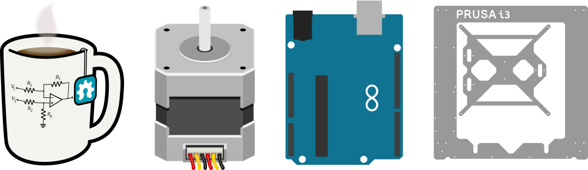

# Introduzione ad Arduino e Stampa 3D

Ciao! questa è la pagina del corso gratuito **Introduzione ad Arduino e Stampa 3D** organizzata dal MUG Roma Tre grazie al finanziamento dell'Università.

## [Prenota qui il quinto incontro: stampa 3D](https://www.eventbrite.it/e/biglietti-introduzione-ad-arduino-e-alla-stampa-3d-quinta-lezione-24605926990)

Per permetterci di gestire meglio gli spazi, per favore prenota il tuo posto su Eventbrite. Lo spazio non manca, ma i kit sono in numero limitato. 

Questa quinta ed ultima lezione sarà dedicata totalmente al mondo della **stampa 3D**: cosa è, quali sono i macchinari più utilizzati, quali sono i programmi da usare per modellare, scansionare, stampare e gestire la propria stampante, il tutto accompagnato dal dolce suono dei motori della nostra stampante che ci produrrà alcuni semplici oggetti.

### Info sul programma e come iscriversi

Il Corso si terrà nel prossimo mese di Aprile, dove lavorerai in gruppo con un kit arduino fornito dall'università per mettere in pratica cosa hai imparato nella lezione. 
Le lezioni si terranno secondo questo calendario:

* martedì 5 e 12 Aprile dalle 18.00 alle 19.30 in aula N1;
* sabato 9 e 16 Aprile dalle 10.00 alle 11.30 in aula DS1 (150 posti disponibili). 

L'ultima settimana sarà dedicata alla stampa 3D, parleremo delle tecnologie utilizzabili già da adesso dagli hobbisti e sarà progettato dal vivo un semplice oggetto stampabile.

Questa pagina e il repo [https://github.com/mugroma3/corso-arduino](https://github.com/mugroma3/corso-arduino) conterrà tutto il materiale prodotto per questo corso.

Per iscriverti, usa il link in cima alla pagina.

### Prese elettriche

Essendo le prese molto limitate, vieni con un portatile con la batteria carica se vuoi partecipare attivamente alla parte pratica della lezione, grazie.
